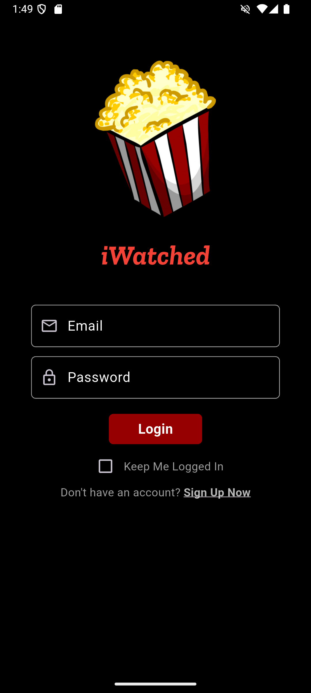
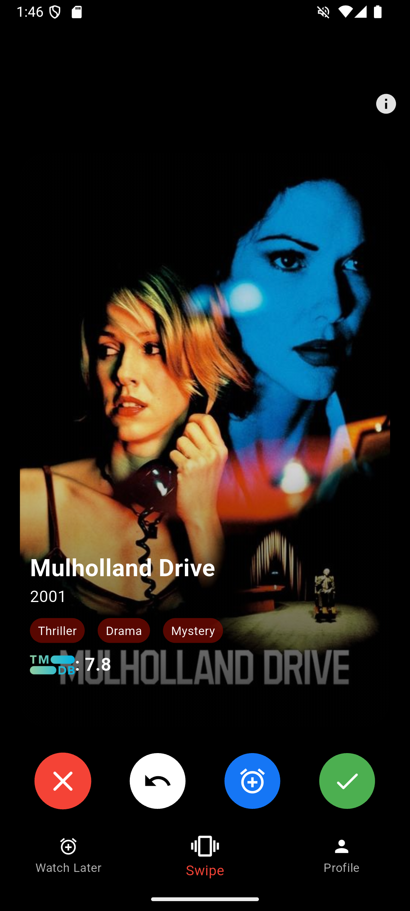
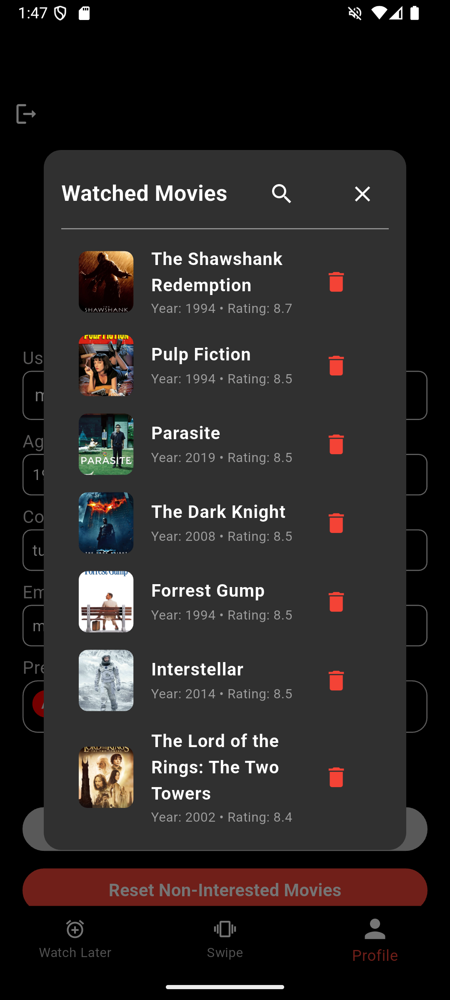
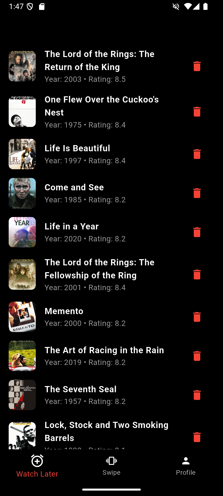

# iWatched - Your Personal Movie Tracking App 🍿🎬

<p align="center">
  
</p>

Discover. Swipe. Remember. Your movie journey in one app.

iWatched is a sleek, intuitive Flutter application that helps movie enthusiasts discover, track, and share their cinematic experiences. With a beautiful dark-themed UI and a powerful recommendation engine, iWatched makes finding your next favorite film effortless.

## ✨ Features

### 🔍 Powerful Discovery
- **Intuitive Swiping**: Discover new movies with a Tinder-like swiping interface.
- **Rich Details**: View comprehensive information including ratings, synopsis, and genre tags.
- **Search Functionality**: Find specific movies with our powerful search feature.

### 📋 Complete Movie Management
- **Watched List**: Keep track of all the movies you've watched.
- **Watch Later**: Save interesting movies for future viewing.
- **Skip List**: Filter out movies you're not interested in seeing.

## 🛠️ Technologies Used
- **Frontend**: Flutter & Dart
- **Backend**: Firebase (Authentication, Firestore)
- **API**: TMDB (The Movie Database) for comprehensive movie data
- **State Management**: GetX for efficient state management and dependency injection
- **Authentication**: Firebase Auth with persistent login capabilities

## 📱 Screenshots
<p align="center">
  
  
  
  
</p>

## 🚀 Getting Started

### Clone the repository
```sh
git clone https://github.com/yourusername/iWatched.git
cd iWatched
```

### Install dependencies
```sh
flutter pub get
```

### Set up environment variables
Create a `.env` file in the root directory and add:
```env
TMDB_API_KEY=your_tmdb_api_key
FIREBASE_PROJECT_ID=your_firebase_project_id
```

### Run the app
```sh
flutter run
```

## 🔒 Environment Setup
To use this app, you'll need:
- A TMDB API key
- A Firebase project with Authentication and Firestore enabled
